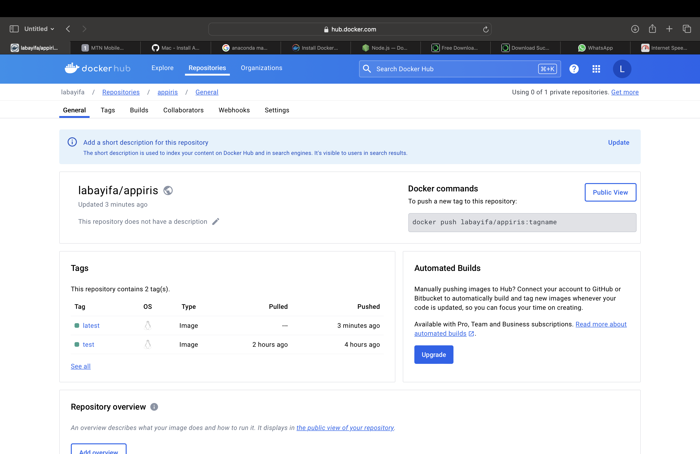
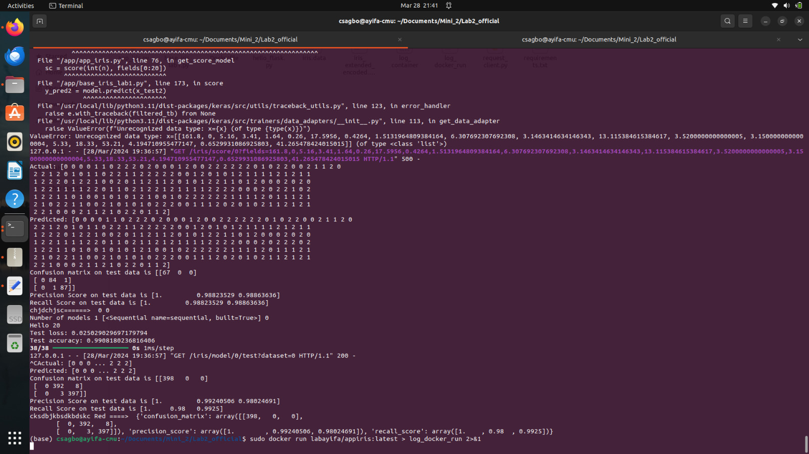
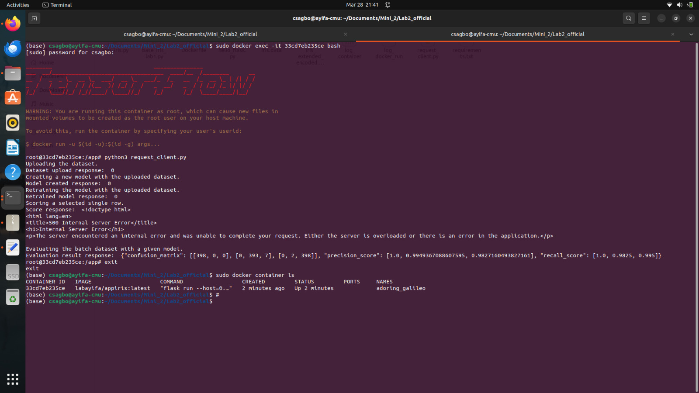

##  Mini 2 Lab 2 csagbo
We implemented for endpoints to:
- Add a batch execution test function

### Docker config
> We Create Dockerfile config to build and push our image to docker hub

> This project files are described below:
> - __*app_iris.py*__ : The Rest API written in python with Flask
> - __*base_iris_lab1.py*__ : 
> - __*iris_extended_encoded.csv*__ :
> - __*request_client.py*__ : The client driver
> - __*logs*__ : Folder containing the logs listed below

> -
> -
> -
