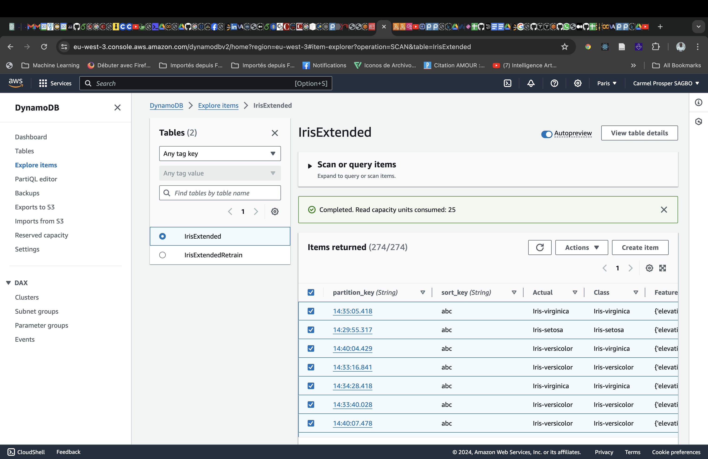
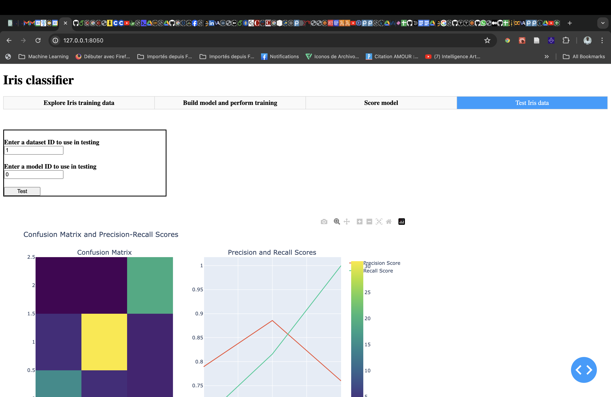

##  Mini 3 Lab 4 csagbo
Dashboards in Dash, part 2 w/AWS

> I created a new user on AWS 
> Created New Role
> Added two Table on DynamoDB
> Attached the role to the user
> Then on DynamoDB I created a triggers with a Lambda Function to log any wrong predicted record.

### Dashboard
> * Explore Iris training data
>   - Load the Iris dataset
>   - Upload a new dataset
>   - Visualize the dataset with different plots (Histogram, Scatterplot)
>   - Dataset overview in a table
> * Build model and perform training. Here we can 
>   - Build a new model by select a given uploaded dataset through it's ID
>   - Retrain an existing model using its ID and a given dataset ID.
> * Score model: 
	- We basically score a row of data which is a set of entries for which we classify the species of Iris. 
> * Test Iris data
> 	- We can test the model with a given dataset ID and get the accuracy of the model.

### Files

> This project files are described below:
> - __*app_lab3_template.py*__ : The main file for the dashboard built with Dash
> - __*app_iris.py*__ : The Rest API written in python with Flask
> - __*base_iris_lab1.py*__ : The base class for the Iris dataset and model
> - __*post_score*__ : Record any entry used during testing
> - __*lambda.py*__ : Contains the lambda function to log the wrong predicted records
> - __*lab4_header.py*__ : Header including the AWS credentials and the DynamoDB table IrisExtended
> - __*iris_extended_encoded.csv*__ : The Iris dataset
> - __*test_iris_extended_encoded.csv*__ : The Test Dataset
> - __*request_client.py*__ : The client driver
> - __*requirements.txt*__ : The requirements file for the project
> - __*logs*__ : Folder containing the logs listed below

### Logs
> Here are the logs for screenshots of the dashboard and the lambda function and tables records and the monitoring of the triggers.
- 
- 
- 
- 
- 
- 
- 
- 

### Running the code:
You can run the code by running the following command in the terminal:

- First Terminal to start the Rest API
   - `python3 app_iris.py`
- Second Terminal to start the Dash application
   - `python3 app_lab3_template.py`
   - Make sure to have the  `request_client.py` file in this same directory to test the application.

- When the applications start take the url of the Dash application and paste it in the browser to view the dashboard.

!!! Thank you for reviewing my submission. !!!

		